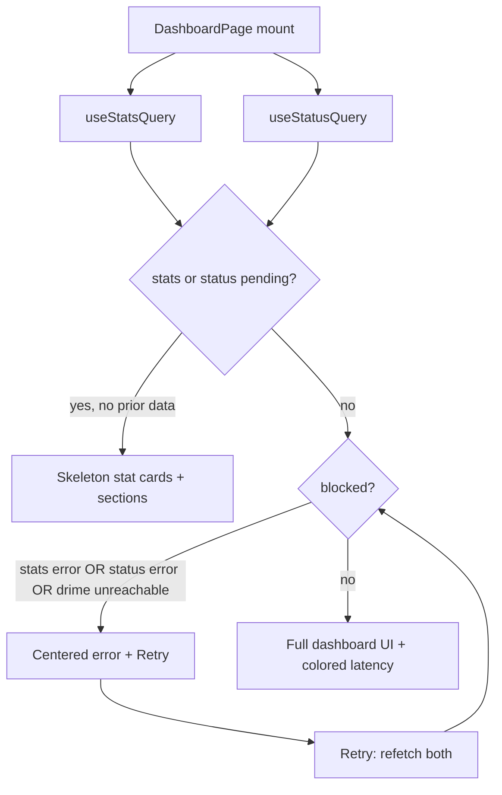

# drime-s3 — Dashboard Error State & Latency Coloring Design

**Date:** 2026-05-22  
**Status:** Approved (brainstorming complete; ready for implementation planning)  
**Author:** Brainstorming session output  
**Related:**
- [2026-05-09-drime-s3-frontend-design.md](./2026-05-09-drime-s3-frontend-design.md) — dashboard page and status contract.

---

## 1. Goal

When the dashboard cannot load reliable workspace data (stats failure, status failure, or Drime reported as unreachable), replace the entire dashboard content area with a centered error message and a **Retry** button. Keep the app shell (sidebar, top bar) visible.

On the success path, color the Drime API latency value in the Workspace stat card according to measured milliseconds.

## 2. Problem

Today `DashboardPage` renders a destructive `Alert` at the top when `useStatsQuery()` errors (`Could not load stats` / `Failed to fetch`), but the rest of the page still renders: stat cards show zeros, **New bucket** stays visible, and the top-buckets section appears empty. That looks like a working dashboard with no data rather than an outage.

Latency is plain muted text (`Drime reachable in 87 ms`) with no visual signal for good vs poor response times.

## 3. Locked-In Decisions

| # | Decision | Choice |
|---|----------|--------|
| 1 | **Chrome visibility** | Sidebar and top bar remain; only `<main>` dashboard content is replaced. |
| 2 | **Blocking conditions** | `statsQuery.isError` **OR** `statusQuery.isError` **OR** (`status.data` exists and `!status.data.drime.reachable`). |
| 3 | **Implementation shape** | Single early-return gate in `web/src/pages/dashboard.tsx` (no shared component in v1). |
| 4 | **Retry** | `Promise.all([statsQuery.refetch(), statusQuery.refetch()])`; button disabled + spinner while either query is `isFetching`. |
| 5 | **First load** | While initial load (`isPending` on stats or status), show existing skeleton stat cards — not the error state. |
| 6 | **Latency thresholds** | &lt;500 ms green, 500–1500 ms amber, &gt;1500 ms red; unreachable uses destructive/muted error text (no latency color). |

## 4. Blocking State — UI

### 4.1 Layout

Replace the dashboard `space-y-8` content (title, **New bucket**, stats grid, top buckets, `CreateBucketDialog`) with:

```tsx
<div
  role="alert"
  aria-live="polite"
  className="flex min-h-[50vh] flex-col items-center justify-center gap-4 px-4 text-center"
>
  {/* icon, title, description, Retry button */}
</div>
```

Matches existing in-app patterns (`bucket-detail` not-found, `error-boundary` card) but scoped to main content height (`min-h-[50vh]`), not full viewport.

### 4.2 Copy

| Condition | Title | Description (primary line) |
|-----------|-------|---------------------------|
| `statusQuery.isError` | Could not reach gateway | `statusQuery.error.message` or fallback `"Unknown error"` |
| `status.data && !drime.reachable` | Drime API unavailable | `status.data.drime.error` or `"Drime API is not responding"` |
| `statsQuery.isError` (status OK + reachable) | Could not load workspace stats | `statsQuery.error.message` or `"Failed to load workspace statistics"` |

Priority when multiple are true: status error → unreachable → stats error (first matching row in render logic).

Remove the old top-of-page destructive `Alert` for stats errors.

### 4.3 Retry button

- Label: **Retry**
- Icon: `RotateCw` from `lucide-react` (same as onboarding wizard)
- `variant="outline"`, `size="default"`
- `onClick`: refetch both queries
- `disabled={statsQuery.isFetching || statusQuery.isFetching}`
- `aria-busy` when fetching

Do not mount `CreateBucketDialog` while blocked (avoids opening create flow during outage).

## 5. Success Path — Latency Coloring

### 5.1 Helper

Add a small pure function (same file or `web/src/lib/latency-color.ts` if tests need it):

```ts
function latencyColorClass(ms: number): string {
  if (ms < 500) return "text-emerald-500";
  if (ms <= 1500) return "text-amber-500";
  return "text-red-500";
}
```

### 5.2 Workspace card hint

Replace string-only `statusLine()` for the reachable case with JSX:

- Muted prefix: `Drime reachable in `
- Colored span: `{latencyMs}` + ` ms` with `latencyColorClass(latencyMs)` and `font-medium tabular-nums`
- Unreachable: keep single muted/destructive line (`data.drime.error ?? "Drime unreachable"`)

`StatCard` hint prop type changes from `string` to `ReactNode` (optional).

## 6. Data Flow



**`blocked` predicate:**

```ts
const blocked =
  statsQuery.isError ||
  statusQuery.isError ||
  (statusQuery.data !== undefined && !statusQuery.data.drime.reachable);
```

Do not treat `!statusQuery.data` without error as blocked (that's still loading or edge case handled by pending).

## 7. Files to Change

| File | Change |
|------|--------|
| `web/src/pages/dashboard.tsx` | Gate, centered error UI, latency JSX, `StatCard` hint type |
| `web/src/pages/dashboard.test.tsx` | Update stats-error test; add status-error, unreachable, retry, latency color tests |
| `web/src/lib/latency-color.ts` | Optional: extract `latencyColorClass` + unit tests |

No backend changes. No changes to `useStatsQuery` / `useStatusQuery` hooks.

## 8. Testing

### 8.1 Replace existing test

`renders error alert when stats endpoint fails` → expects **no** `Could not load stats` alert at top; expects centered `role="alert"`, title, **Retry**, and **absence** of workspace stats region / **New bucket**.

### 8.2 New cases

1. **Status fetch fails** — mock `/_admin/status` → 500; assert blocking UI, gateway title.
2. **Drime unreachable** — status 200 with `drime: { reachable: false, latencyMs: 3000, error: "timeout" }`; stats can succeed or fail; assert blocking UI with Drime title and timeout message; dashboard sections hidden.
3. **Retry** — after error, mock success, click Retry, assert dashboard content returns.
4. **Latency colors** — three status mocks with `latencyMs` 100 / 800 / 2000; assert hint contains colored ms (class or `toHaveClass`).
5. **Happy path unchanged** — existing integration test still passes with reachable + stats OK.

Use `createTestQueryClient()` with `retry: false` (existing test utils).

## 9. Non-Goals

- Full-screen takeover (hide sidebar/topbar).
- Auto-polling status on dashboard (onboarding keeps its own interval).
- Shared `PageErrorState` component reused across buckets/detail pages.
- Tooltips or legend for latency color meanings (thresholds are self-evident; add later if needed).

## 10. Acceptance Criteria

- [ ] On stats, status, or Drime-unreachable failure, main area shows only centered error + Retry; no stat cards, top buckets, or **New bucket**.
- [ ] Sidebar and top bar still visible.
- [ ] Retry refetches both endpoints and restores dashboard when APIs recover.
- [ ] Reachable latency &lt;500 ms renders green; 500–1500 amber; &gt;1500 red.
- [ ] All `dashboard.test.tsx` cases pass.
