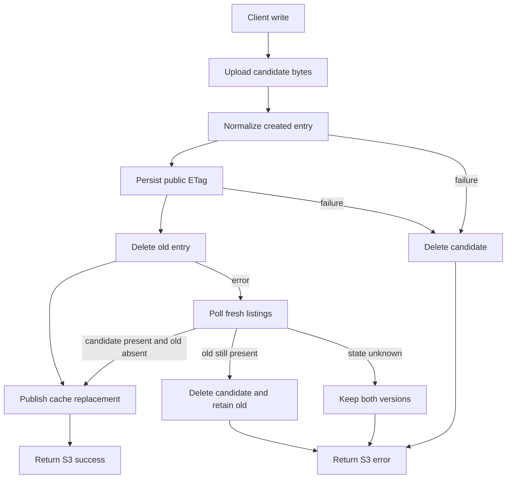

# Production Upload Reliability Design

**Date:** 2026-09-16  
**Status:** Approved for implementation planning  
**Scope:** S3 object PUT and multipart completion reliability

## 1. Problem

Production S3-to-S3 syncs expose four related failures:

1. Client multipart completion returns a composite ETag such as
   `d45ed42df3c8c36f89e03695be4cca69-13`, but the immediate HEAD returns a
   plain 32-character hash. rclone reports `multipart upload corrupted`.
2. Presigned internal multipart part uploads intermittently return 502. The
   gateway currently fails the whole object after the first failed part.
3. Replacement deletes the old Drive entry before the new object is ready. A
   later upload failure leaves the key missing.
4. Eventually consistent Drive listings can return a deleted entry. Retrying
   its deletion produces `422: selected entry ids is invalid`, and immediate
   HEAD can resolve stale metadata.

The current ETag persistence path does not make failures visible: an
unrecognized `/s3/entries` response skips the update, and errors from
`updateFileEntryDescription` are swallowed.

## 2. Goals

- A successful write is immediately readable through HEAD, GET, and list with
  the ETag returned to the S3 client.
- A failed overwrite preserves the previously committed object.
- Transient part-upload failures are retried without restarting the whole
  object.
- Replacement retries are idempotent and do not leave visible duplicate keys.
- Ordinary PUT and client multipart ETags follow their distinct S3 semantics.
- Failures identify the stage and relevant entry IDs without logging secrets or
  signed URLs.

## 3. Non-goals

- Providing an atomic replacement guarantee from the upstream Drime API, which
  exposes no atomic rename or replace operation.
- Persisting multipart sessions across gateway restarts.
- Hiding permanent Drime API failures from clients.
- Adding a database or external cache.

## 4. ETag Semantics

The public ETag is determined by the S3 operation, not by the transport used
between drime-s3 and Drime:

- **Ordinary S3 PUT:** the full-body MD5 computed while spooling the request,
  even when drime-s3 internally uploads that body in parts.
- **Client-initiated S3 multipart upload:** the AWS-style composite
  `MD5(concatenated part MD5 digests)-partCount`.

The chosen public ETag is persisted in the Drive entry description before the
new entry becomes visible. The gateway must not return a successful S3 response
if it cannot identify the created entry or persist this metadata.

## 5. Architecture

### 5.1 Created-entry normalization

Introduce one parser for every upload path that normalizes the production
Drime response into a `FileEntry`. It accepts the known wrappers
`fileEntry`, `file`, `entry`, and `data`, plus a direct entry object. Positive
integer IDs represented as numbers or decimal strings are accepted.

If the response contains a valid ID but omits optional fields, construct the
remaining cache entry from the known upload inputs. Download URL resolution
already falls back to `/file-entries/{id}/download`. A response without a
valid positive ID is an explicit registration failure. Because such a response
cannot support safe rollback by ID, emit a high-severity orphan-candidate log
and return 500 rather than guessing from duplicate names.

### 5.2 Replacement coordinator

Use one create-first replacement coordinator from:

- ordinary PUT through `/uploads`;
- ordinary PUT transported through internal multipart;
- client `CompleteMultipartUpload`;
- copy-object where the destination exists.

The coordinator receives the old resolved entry, newly created candidate,
parent ID, public ETag, and expected object attributes. It performs:

1. Validate and normalize the candidate entry.
2. Persist the public ETag metadata on the candidate.
3. Delete the old entry, if one existed.
4. Publish one authoritative cache replacement from old ID to candidate.
5. Return the committed candidate.

Until step 4, concurrent reads continue to see the old object. After step 4,
they see the candidate. The unavoidable duplicate-name interval exists only
between candidate creation and old-entry deletion.

If steps 1 or 2 fail, delete the candidate and leave the old entry untouched.
If old-entry deletion fails, confirm the real upstream state by fresh listing
and then either continue as committed, roll back the candidate while the old
entry is known to be present, or — when the state stays unknown — keep both
versions and fail the write (see §6). Success is returned only after
publication.

### 5.3 Read-your-writes overlay

Extend the list cache with a short-lived authoritative replacement overlay per
parent folder:

- remove the old entry ID from fetched or cached listings;
- suppress stale same-name versions of the replaced object;
- inject the committed candidate;
- apply the overlay to both cache hits and newly completed upstream fetches.

The overlay reconciles when an upstream listing contains the candidate and no
longer contains the old ID. It expires after 60 seconds, with a warning if
Drime has not converged. Existing cache size limits also apply to overlays.

This prevents an in-flight or immediate post-write fetch from restoring a
deleted entry. It also makes HEAD, GET, and list agree during Drime's
eventual-consistency window.

### 5.4 Replay-safe part retry

Internal multipart parts are buffered, so each part PUT is replayable. Retry
network errors and HTTP 429, 502, 503, and 504 up to five total attempts using
exponential backoff starting at 250 ms, capped at 4 seconds, with jitter. Other
4xx responses fail immediately.

Retries occur inside each part lane and do not increase configured lane
concurrency. Exhaustion aborts the multipart upload and returns an S3
`InternalError`. Logs include part number, status, and attempt, but exclude the
presigned URL and response credentials.

## 6. Idempotency and Failure Handling

- No old-entry deletion error is automatically success. **Every** deletion
  error — the exact invalid-entry-IDs 422, any 5xx, and network or timeout
  failures alike — is resolved against fresh, uncached listings. The Drime 422
  classification is diagnostic only; it no longer decides control flow.
- A successful commit requires positive proof of both halves of the
  replacement: the candidate ID present **and** the old ID absent. An absent
  old ID alone is not accepted, because a listing that shows neither row
  establishes nothing.
- **Ambiguous-delete policy (user-approved, data preservation over
  tidiness):** if the confirmation window ends without a known state — every
  listing failed, or the final listing shows neither the candidate committed
  nor the old entry present — the candidate is **kept**, no success is
  published, and the caller receives an explicit `old_delete` failure plus a
  high-severity `replacement_ambiguous_data_preserved` log carrying only safe
  identifiers. This can leave a duplicate or an orphan for an operator to
  reconcile; it cannot delete both versions of the object. A duplicate is
  recoverable, a double delete is not.
- The candidate is rolled back only when the old entry is known to be intact:
  the metadata stage failed before the old entry was touched, or the final
  confirmation listing still shows the old ID. Only the final poll may
  establish `old_present`, so a stale listing early in the window cannot
  trigger a rollback that races a deletion Drime has already applied.
- Candidate cleanup is best effort when the candidate ID is known. Cleanup
  failure returns 500 and emits a high-severity log with bucket, key, old ID,
  candidate ID, and failed stage.
- The public ETag is validated as a 32-character MD5 or a composite
  `md5hex-partCount` with a positive part count before it is persisted; a
  malformed ETag fails the write rather than poisoning later HEAD/GET parity.
- Resolver behavior must be deterministic if historical duplicates already
  exist. Prefer the entry selected by an active replacement overlay; without
  one, report the duplicate rather than silently choosing an arbitrary entry
  for mutation.
- Multipart storage completion can leave an unregistered upstream blob if
  candidate registration fails. Abort or cleanup is attempted where Drime
  permits it, but no false S3 success is returned.
- ETag metadata persistence uses the Drime client's existing retry policy for
  transient statuses. Permanent failure triggers candidate rollback.

## 7. Data Flow

## 8. Tests

### Unit tests

- Parse all supported created-entry response shapes, numeric string IDs, and
  reject missing or invalid IDs.
- Retry replayable part PUTs after network failure and each retryable status.
- Do not retry permanent 4xx responses.
- Exhausted retries abort the multipart upload.
- Ordinary PUT transported as multipart exposes and persists full-body MD5.
- Client multipart completion exposes and persists the composite ETag.
- Overlay merges into cache hits and in-flight/fresh listing results.
- Overlay reconciliation removes converged replacements.
- A delete error whose fresh listing shows the candidate present and the old ID
  absent commits, for the invalid-entry-IDs 422 and for 5xx/timeout alike.
- A listing missing the candidate is not accepted as a successful delete.
- Failed or inconclusive confirmation keeps the candidate and fails the write.
- Thrown coordinator errors carry sanitized causes: serializing them with Pino
  never reveals an upstream response body.
- A malformed public ETag is rejected before persistence.

### Integration tests

- Immediate HEAD and GET after client multipart completion return the exact
  completion ETag while the mock Drive listing remains stale.
- Metadata failure preserves the old object and returns an S3 error.
- Old-entry deletion failure removes the candidate and preserves the old
  object.
- Confirmed already-absent old ID makes retry succeed.
- A 422 for an ID still present does not get misclassified as success.
- Repeated overwrite retries leave one visible object.
- Part 502 followed by success completes without restarting the object.
- Concurrent HEAD during replacement sees either the complete old object or
  complete new object, never a missing key.

## 9. Observability

Emit structured logs for `upload_part_retry`, `candidate_registered`,
`etag_persist_failed`, `old_delete_failed`, `replacement_committed`,
`replacement_rollback_failed`, and `replacement_ambiguous_data_preserved`.
Include request ID, bucket, key, stage, entry IDs, part number, attempt, and
status where applicable. `old_delete_failed` also carries the confirmation
outcome (`committed`, `old_present`, or `unknown`).

Never include API keys, authorization headers, request bodies, or presigned
URLs. Upstream errors are never attached as an `Error.cause` in raw form:
Pino's error serializer walks the `cause` chain and would republish a
`DrimeApiError` response-body preview, so causes are replaced with sanitized
errors that carry the status without the body.

## 10. Rollout

1. Run unit and integration suites with deterministic 502 and stale-listing
   fixtures.
2. Publish a patch image under an immutable version tag.
3. Deploy with internal multipart concurrency reduced to 1 or 2 for the first
   production sync.
4. Verify the running `/_health` version before restarting rclone.
5. Sync a small prefix containing both new objects and overwrites.
6. Confirm matching PUT/complete and HEAD ETags and absence of rollback errors.
7. Resume the full sync with one rclone transfer, then raise concurrency only
   after a clean observation window.

## 11. Acceptance Criteria

- The production reproduction no longer reports `Etag differ`,
  `md5 hashes differ`, or replacement-caused `object not found`.
- An injected part 502 succeeds through a per-part retry.
- An injected permanent upload or metadata failure leaves the prior object
  readable.
- Immediate HEAD after successful completion returns the exact response ETag.
- No successful response is emitted before ETag persistence and cache
  publication complete.
- No failure path can delete both the old entry and its replacement: an
  unresolvable delete error leaves at least one complete version readable.
